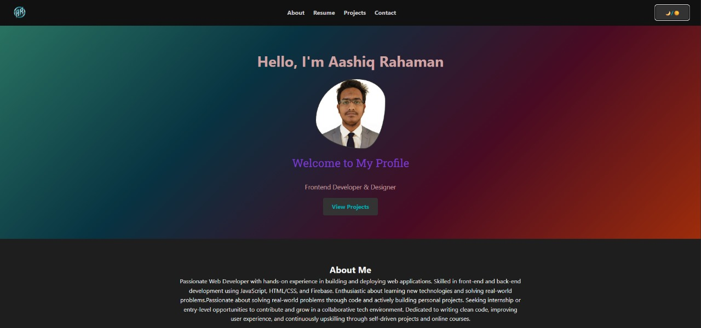
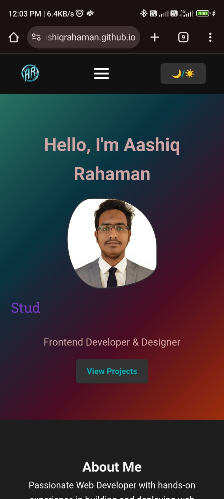

# 💼 Aashiq Rahaman — Personal Portfolio Website

Welcome to the source code of my **personal portfolio website**, a modern, responsive, and lightweight site built using HTML, CSS, and JavaScript. This portfolio showcases my skills, projects, resume, and provides easy ways to contact me.

---

## 🔗 Live Demo

🌐 [Visit My Portfolio](https://aashiqrahaman.github.io/Aashiq_Rahaman/)

---

## 🚀 Features

- ✅ Responsive Design (Mobile & Desktop Friendly)
- 🌙 Dark Mode Toggle with Local Storage
- ✍️ Typing Animation for Hero Text
- 📄 Resume & CV Download
- 💻 Projects Showcase
- 📬 Contact Form (email integration ready)
- 🔗 Social Media Links (GitHub, LinkedIn, etc.)
- ⚡ Smooth Scroll Navigation
- 🧠 SEO Tags, Open Graph Meta, Google Analytics-ready

---

## 🛠️ Technologies Used

- **HTML5** for structure  
- **CSS3** with Flexbox & Grid  
- **JavaScript (ES6)** for interactivity  
- **Font Awesome** for icons  
- **Formspree / EmailJS** *(optional)* for contact form backend  
- **Responsive media queries** for mobile support  

---

## 📁 Folder Structure

portfolio/

├── index.html # Homepage

├── contact.html # Dedicated Contact Page

├── style.css # All styling (dark + light)

├── script.js # JS for interactivity & dark mode

├── assets/ # Profile image, resume.pdf, favicon, etc.

└── README.md # This file

---

## 📷 Screenshots

| Desktop View | Mobile View |
|--------------|-------------|
|  |  |

---

## 🧑‍💻 How is it

1. **Check my web page**  
https://aashiqrahaman.github.io/Aashiq_Rahaman/
   <!-- ```bash
   git clone https://github.com/your-username/portfolio.git
   cd portfolio -->